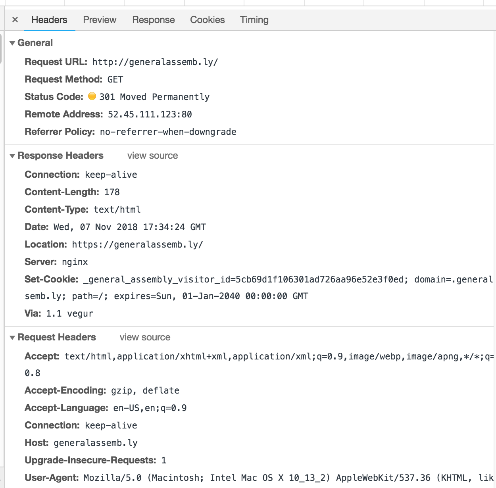
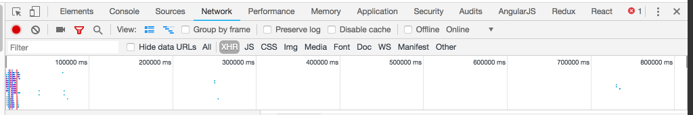
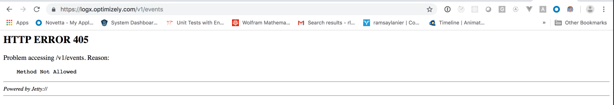

#  AJAX & APIs (3:00)

- APIs: Introduction
- HTTP: Recap
- HTTP demo
- Consumer Finance Data: Independent Practice
- jQuery AJAX
- Open Weather Map: Independent Practice
- Final Questions & Exit Tickets

###  Objectives
*After this lesson, students will be able to:*

- Identify all the HTTP Verbs & their uses.
- Describe APIs and how to make calls and consume API data.
- Access public APIs and get information back.
- Implement an AJAX request with Vanilla JS.
- Implement a jQuery AJAX client for a simple REST service.
- Reiterate the benefits of separation of concerns – API vs. Client.

### Preparation
*Before this lesson, students should already be able to:*

- Implement advanced jQuery events.
- Use event delegation to manage dynamic content.
- Use implicit iteration to update elements of a jQuery selection and chaining to place methods on selectors.
- Add a templating language to our projects for better content manipulation.

---

## APIs: Introduction

Last class we learned the importance of separation of concerns. It's best practice to separate DOM logic from our data models. This not only allows for cleaner code, but is an easier way to manipulate our layouts and interactions. Separation of concerns becomes ever more important when working with outside data. Let's take a few scenarios where we want to pull data from an external API:

- Twitter client
- Feed reader
- Weather forecasting app
- Social game sharing high scores
- Any app with user log in

Given the increase in the number of devices and platforms, [Service Oriented Architectures (SOA)](https://en.wikipedia.org/wiki/Service-oriented_architecture) have become increasingly prevalent and are soon becoming best practice. SOAs allow us to build one backend/database to share across all of these platforms. This means that our applications will not only deal with external APIs, but also rely on these services for our core data.

### API Gotchas

API calls are really a fancy term for making HTTP requests to a server and sending/receiving structured data from that endpoint. We are still communicating with URLs, however instead of receiving markup, like we do with HTML pages, we receive data. If that data is structured as JSON, we can easily start reacting and communicating with it thanks to the provided JSON methods.

Because our pages will be fully or partially rendered on the client side after we receive this data, there are a few best scenarios we need to take into account:

  - Certain APIs require authentication, and we need to provide an API key either as a request parameter, in the header, or in the body of the call.
  - When we make an API call after a user action, we need to give the user feedback that something is happening.
  - We update our view(s) only after we get a return from the server.
  - We need to account for us not receiving data back due to different interruptions/causes:
    - Server timeout
    - Wrong authentication information
    - User loses connection
    - Request URL not found
- [Representational state transfer (REST)](https://en.wikipedia.org/wiki/Representational_state_transfer) is the most common architecture style for passing information to and from these API endpoints.

Before we start consuming these services however, it's important to understand the fundamentals of the underlying communication layer. This communication layer (HTTP) will be responsible for transporting our API calls.

---
## HTTP: Recap (25 min)

HTTP is a protocol - a system of rules - that determines how web pages (see:'hypertext') get sent (see:'transferred') from one place to another. Among other things, it defines the format of the messages passed between **HTTP clients** and **HTTP servers**.


Since the web is a service, it works through a combination of **clients which _make_ requests** and **servers (which _receive_ requests)**.

### HTTP Client

**HTTP Clients make or generate HTTP Requests.** Some types of clients are:

* Browsers - Chrome, Firefox and Safari.
* Command Line programs - [curl](http://curl.haxx.se/docs/) and [wget](http://www.gnu.org/software/wget/manual/wget.html).

**HTTP Clients respond to HTTP Responses from a Web Server.** They process the data being returned form a **Web Server, aka HTTP Server.**

### HTTP/Web Server

An *HTTP server* is a piece of software that understands URLs (web addresses) and HTTP (the protocol that is used by browsers to view webpages). We access HTTP servers using domains names, such as *http://google.com*. 

A *Web Server* is hardware (a computer) that accepts HTTP requests and responds to them by serving files that are necessary to run a website or application. A web server handles these requests by using software. In this class, we'll be using Node.js to build web servers. 

[Read more about web servers](https://developer.mozilla.org/en-US/docs/Learn/Common_questions/What_is_a_web_server).

### Web Applications

Are programs built by a developer, sometimes using a framework like Express (built using Node). These programs plug into a web server, process the **HTTP requests** that the server receives, and generate **HTTP Responses**.


Lost? Here's the play-by-play.

1. A client sends a **HTTP Request** to a **HTTP Server** running on a remote machine.  
  * The **hostname**, given in the URL, indicates which server will receive the request.  
2. The **HTTP server** processes the **HTTP Request**. This may entail passing the request to some **Web Application**, which creates a **HTTP Response**.
3. The response gets sent back to the client.
4. The client processes the response.

**How does the server know what the request is asking for? This is specified by the URL**, a special kind of path that specifies where a **resource** can be found on the web.


> Technically, the term 'resource' refers to an abstraction that your application uses; depending on what the application does. A resource might be a 'Car', a 'Person', a 'User', or an 'Order Cart'. A single resource can be represented in multiple different ways by the server, including a HTML, JSON, PDF files, and images. What we really mean when we say 'resource' above is a specific **representation** of a resource.

---

<a name = "demo"></a>
## HTTP: Demo

Lets explore HTTP resources. We'll start by looking at HTTP requests and responses using the Chrome Inspector.


* In Chrome, open up Chrome Inspector (*command + option + 'i', or ctrl + click and select 'inspect element'*).
* Select the Network tab. It should look something like this:


* Next, go to the **URL** https://generalassemb.ly/

  You should be able to see a few HTTP Requests and Responses in the Network tab; for each request you'll see a **Name**, **Status**, **Type**, and **Size**, along with info about how long it took to get each of these resources.
  *Most of this information comes from the HTTP Request and Response.*

  * Some HTTP requests are for CSS, JavaScript and images that are referenced by the HTML.
  * Select `generalassemb.ly` in the Name column on the far left.
  * Select the Headers tab. **Headers** are meta-data properties of an HTTP request or response, separate from the body of the message.

### HTTP Request

You should see three drop downs, **General**, **Response Headers**, and **Request Headers**.



**HTTP Request Methods:**   

* **GET** => Retrieve a resource.  
* **POST** => Create a resource.  
* **PATCH** (_or **PUT**, but **PATCH** is recommended_) => Update an existing resource.  
* **DELETE** => Delete a resource.  
* **HEAD** => Retrieve the headers for a resource.

Of these, **GET** and **POST** are the most widely used.

### HTTP Response

When a client sends a request, the server sends back a response. Response have **status codes**.

**[Status Codes](http://en.wikipedia.org/wiki/List_of_HTTP_status_codes)** have standard meanings; here are a few.

|Code|Reason|
|:---|:-----|
|200| OK
|301| Moved Permanently
|302| Moved Temporarily
|400| Bad Request
|403| Forbidden
|404| Not Found
|500| Internal Server Error

Now, lets look at some **XML HTTP Requests** or **XHR**. In the filter toolbar of chrome dev tools you can filter different types of requests. Select XHR.


Lets select the "events" request and look at the HTTP headers. Notice the request URL is "https://logx.optimizely.com/v1/events". It looks like the GA website is calling an external API and geting some returned events. Also notice that its a POST request. What happens if we copy this URL into our browsers? 



We get a 405 error because our Browsers makes a GET request; however, the HTTP server is configured to only accept POST requests at this endpoint. 

Now, back in our dev tools we see an additional dropdown called **Request Payload**. This is some JSON that we pass along with our request. This is how the API endpoint knows what data to return.

---

<a name = "codealong"></a>
## AJAX and JavaScript: Codealong

AJAX stands for Asynchronous JavaScript and XML. It sends and receives information in a variety of formats. The most commonly used format for communicating with APIs, as we've seen, is JSON. AJAX allows us to not only communicate with servers, but it allows us to do this asynchronously, meaning it happens in the background, allow us to update our interfaces and content without refreshing the page.

To make an HTTP request with AJAX we need to first create an instance of `XMLHttpRequest` and then decide how we want to handle the response by setting the `onreadystatechange` method of the XMLHTTPRequest object to a custom function.

```js
  // Create instance of XMLHTTPRequest
  let httpRequest = new XMLHttpRequest();

  // Set a custom function to handle the request
  httpRequest.onreadystatechange = responseMethod;

  function responseMethod() {
    // Request logic
  }

  // Alternative method:
  // httpRequest.onreadystatechange = function() {
  //   
  // }
```

Before we do anything with the request, we need to first check its state. If the state tells us that the request is done, we can then handle the return of the request. There are two primary scenarios for handling the request:

  - We check for a success and update our application logic
  - We check for an error and notify the user

```js
  function responseMethod() {
    // Check if our state is "DONE"
    if (httpRequest.readyState === XMLHttpRequest.DONE) {
      // If our request was successful we get a return code/status of 200
      if (httpRequest.status === 200) {
        // This is where we update our UI accordingly. Our data is available to us through the responseText parameter
        console.log(httpRequest.responseText);
      } else {
        // This is the scenario that there was an error with our request
        console.log('There was a problem with the request.');
      }
    }
  }
```

After we have defined what happens in both successful and erroneous scenarios, we finally open and send our request.

```js
  var httpRequest = new XMLHttpRequest();

  httpRequest.onreadystatechange = responseMethod;

  // Open method accepts 3 parameter:
  // 1. Request type: these are all the HTTP verbs we covered above
  // 2. The URL
  // 3. Optional boolean third parameter, that dictates wether this is an asynchronous call (default is true)
  httpRequest.open('GET', 'http://data.consumerfinance.gov/api/views.json');

  // The send method takes an optional parameter. If our API request allows additional parameters or JSON objects to be passed through (primarily through POST requests), we pass them in the send method.
  httpRequest.send();

  // NOTE: certain APIs may require us to pass additional header data, including setting the MIME type of the request. We can do this through the setRequestHeader method.
  // httpRequest.setRequestHeader('Content-Type', 'application/x-www-form-urlencoded');
```
---

<a name = "lab1"></a>
## Consumer Finance Data: Independent Practice (40 min)

- Refactor the codealong to work with user interaction. In the [index.html](starter-code/ajax_excercise/main.js) file there is a "Get Consumer Finance Data" button. When the user clicks the button, pull data from the provided link above (http://data.consumerfinance.gov/api/views.json). Handle the link success and error responses accordingly, displaying results in console.log() if successful.
- Separate your logic so that you can use your functions for another user button
click of "Get Custom Data", which will make a request to 
https://data.cityofnewyork.us/api/views/jb7j-dtam/rows.json?accessType=DOWNLOAD

---

## jQuery AJAX (20 minutes)

Vanilla JavaScript AJAX functionality gives us everything we need to make http requests, however it takes 4-5 steps to make the call and get the information back, without much other added benefit. Furthermore, certain older browsers handle AJAX calls differently. We are already familiar with jQuery's DOM helper methods. Just like with the DOM, jQuery has some very useful convenience methods to interact with cross platform requests.

jQuery allows us to create quick get and post requests in one step, as opposed to the above multiple steps.

```js
  // All we need to create a get or post request is use the get or post method
  $.get( 'https://data.cityofnewyork.us/api/views/jb7j-dtam/rows.json?accessType=DOWNLOAD', function( r ) {
      // We get the data back from the request in the parameter we pass in the function
      console.log(r);
  });
```

Get and post methods are very useful and easy to work with, however there will be scenarios where we need more granularity to handle our requests. The `$.ajax()` method allows us significantly more granularity.

```js
  $.ajax({
      url: "https://data.cityofnewyork.us/api/views/jb7j-dtam/rows.json?accessType=DOWNLOAD",

      // Tell YQL what we want and that we want JSON
      data: {
          // q: "select title,abstract,url from search.news where query=\"cat\"",
          format: "json"
      },

      // Work with the response
      success: function( response ) {
          console.log( response ); // server response
      }

      // Full list of options includes:
      // accepts: The content type sent in the request header that tells the server what kind of response it will accept in return
      // async: Set this options to false to perform a synchronous request
      // beforeSend: A pre-request callback function that can be used to modify the jqXHR object before it is sent
      // cache: Set this options to false to force requested pages not to be cached by the browser
      // complete: A function to be called when the request finishes (after success and error callbacks are executed)
      // contents: An object that determines how the library will parse the response
      // contentType: The content type of the data sent to the server
      // context: An object to use as the context (this) of all Ajax-related callbacks
      // converters: An object containing dataType-to-dataType converters
      // crossDomain: Set this property to true to force a cross-domain request (such as JSONP) on the same domain
      // data: The data to send to the server when performing the Ajax request
      // dataFilter: A function to be used to handle the raw response data of XMLHttpRequest
      // dataType: The type of data expected back from the server
      // error: A function to be called if the request fails
      // global: Whether to trigger global Ajax event handlers for this request
      // headers: An object of additional headers to send to the server
      // ifModified: Set this option to true if you want to force the request to be successful only if the response has changed since the last request
      // isLocal: Set this option to true if you want to force jQuery to recognize the current environment as “local”
      // jsonp: A string to override the callback function name in a JSONP request
      // jsonpCallback: Specifies the callback function name for a JSONP request
      // mimeType: A string that specifies the mime type to override the XHR mime type
      // password: A password to be used with XMLHttpRequest in response to an HTTP access authentication request
      // processData : Set this option to false if you don’t want that the data passed in to the data option (if not a string already) will be processed and transformed into a query string
      // scriptCharset: Sets the charset attribute on the script tag used in the request but only applies when the “script” transport is used
      // statusCode: An object of numeric HTTP codes and functions to be called when the response has the corresponding code
      // success: A function to be called if the request succeeds
      // timeout: A number that specifies a timeout (in milliseconds) for the request
      // traditional: Set this to true if you wish to use the traditional style of param serialization
      // type: The type of request to make, which can be either “POST” or “GET”
      // url: A string containing the URL to which the request is sent
      // username: A username to be used with XMLHttpRequest in response to an HTTP access authentication request
      // xhr: A callback for creating the XMLHttpRequest object
      // xhrFields: An object to set on the native XHR object

      /* Options definition referenced from http://www.sitepoint.com/use-jquerys-ajax-function/ */
  });
```
---

<a name = "lab2"></a>
## Open Weather Map: Independent Practice (30 min)

Let's bring it all together. Open the [main.js](starter-code/jquery_ajax/main.js) file. We will talk with a weather API, and retrieve weather information. Thus far we have worked with just pulling static URLs. Follow the steps below.

- Review the API documentation at https://openweathermap.org/current
- User either $.ajax or $.get to pull weather current data .
  for Washington DC (hint: http://api.openweathermap.org/data/2.5/weather?q=...).
- Print the temperature in console.
- Update the UI so that the temperature gets rendered
- Use the form elements to let the user select their own city and country

---
<a name = "conclusion"></a>
## Conclusion (5 min)

Make sure class objectives have been met:

- Reiterate the benefits of separation of concerns – API vs. Client.
- Identify all the HTTP Verbs & their uses.
- Implement an AJAX request with Vanilla JS.
- Implement a jQuery AJAX client for a simple REST service.

#### Additional Resources

- [jQuery: Ajax][1]
- [Sitepoint: jQuery Ajax][2]
- [MDNL JS Ajax][3]
- [Wikipedia: API][4]
- [What's an HTTP Request?][5]

[1]: https://learn.jquery.com/ajax/
[2]: http://www.sitepoint.com/use-jquerys-ajax-function/
[3]: https://developer.mozilla.org/en-US/docs/AJAX/Getting_Started
[4]: https://en.wikipedia.org/wiki/Application_programming_interface
[5]: http://rve.org.uk/dumprequest
